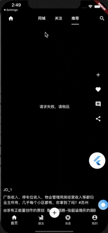
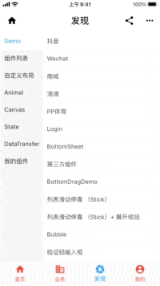
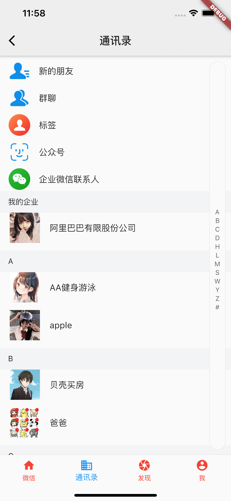
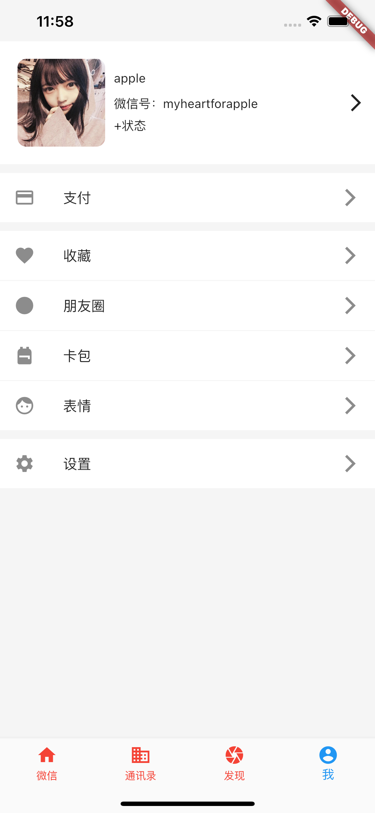
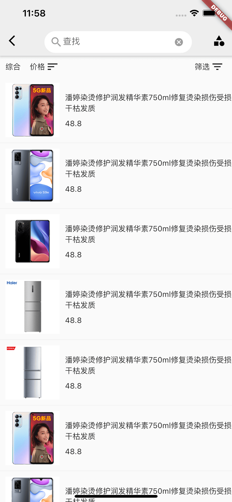

# flutter_app






### 抖音


### 微信






### 商城





### 现有功能

1、登录

2、注册

3、欢迎页

4、启动广告页

5、首页

6、抽屉页

7、二维码

8、瀑布流

9、基本组件demo模块

10、会员首页

11、设置页面


### 使用的第三方库

```
# 图标库
  cupertino_icons: ^0.1.2
  #应用信息
  package_info: ^0.4.1
  #因为单词
  english_words: ^3.1.5
  #相册
  image_picker: ^0.6.6
  #打开第三方应用
  url_launcher: 5.4.2
  #网络
  dio: ^3.0.9
  dio_http_cache: ^0.2.6
  dio_cookie_manager: ^1.0.0
  cookie_jar: ^1.0.0
  #path
  path_provider: ^1.6.9
  #二维码
  qr_flutter: ^3.1.0
  #保存图片
  image_gallery_saver: ^1.2.2
  #获取权限
  permission_handler: ^3.0.1
  #webview
  webview_flutter: ^0.3.19+8
  #设备版本信息
  device_info: '>=0.4.1+5 <2.0.0'
  #下拉刷新
  pull_to_refresh: ^1.5.8
  #Swiper库
  flutter_swiper: 1.1.6
  #网络图片库
  cached_network_image: ^2.2.0
  #持久化数据库
  shared_preferences: 0.5.6+2
  #本地json对象存储
  localstorage: ^2.0.0
  #网络状态监听
  connectivity: 0.4.8+1
  #大图预览
  photo_view: ^0.9.2
  #toask
  fluttertoast: ^4.0.0
  # 屏幕适配
  flutter_screenutil: ^1.1.0
  # 视频播放
  #fijkplayer: ^0.8.3
  # rxdart https://github.com/ReactiveX/rxdart
  rxdart: ^0.23.1
  #国际化
#  fluintl: ^0.1.3
  # 分享
  share: ^0.6.4+1
  # 状态管理
  provider: ^4.1.2
  #组件库
  flukit: 1.0.2
  #html
  flutter_html: ^ 1.0.0
  #链式编程
  widget_chain: ^0.1.0
  #升级
  flutter_app_upgrade: ^1.0.2
  #闪光
  shimmer: ^1.0.0

  camera: ^0.5.8+2
  video_player: '>=0.10.11+1 <2.0.0'

  extended_nested_scroll_view: ^1.0.0
  #瀑布流
  flutter_staggered_grid_view: ^0.3.0

```


### 过程问题：

1、BottomNavigationBar 超过4个底部控制颜色变白：https://www.jianshu.com/p/946f1e476ca5

2、shrinkWrap 解决gridview不能在customScrollView显示的问题

4、

因误操作user方法又返回了user对象导致报了下面的错误，定位了好久

```
User get user {
    if (_user != null) {
      return user;
    }
    _user =  User.fromJson(SpUtil.getObject("pp_user"));
    return _user;
  }
```


```
════════ Exception caught by widgets library ═══════════════════════════════════════════════════════
The following StackOverflowError was thrown building JDDrawer(dirty, dependencies: [MediaQuery, _InheritedProviderScope<JDGlobal>], state: _JDDrawerState#1f0fd):
Stack Overflow

The relevant error-causing widget was: 
  JDDrawer file:///Users/jd/Documents/Project/flutter/flutter_component/lib/page/scaffold/jd_scaffold_page.dart:36:29
When the exception was thrown, this was the stack: 
#0      JDGlobal.user (package:flutter_component/init/jd_global.dart:23:3)
#1      JDGlobal.user (package:flutter_component/init/jd_global.dart:25:14)
#2      JDGlobal.user (package:flutter_component/init/jd_global.dart:25:14)
#3      JDGlobal.user (package:flutter_component/init/jd_global.dart:25:14)
#4      JDGlobal.user (package:flutter_component/init/jd_global.dart:25:14)
...
════════════════════════════════════════════════════════════════════════════════════════════════════
Reloaded 17 of 1161 libraries in 1,473ms.

```


5、网络请求增加mock功能

6、保存相册 报Swift问题 ，增加use_frameworks!即可

7、InkWell 下面的Container设置color会导致水波纹无效

8、android studio  GradleException报错    死命的更新就行了

9、NestedScrollView导致其body的tabbarview的多个list同步滚动的解决方案  https://www.jianshu.com/p/ab473fb8ceb0

10、Listview addRepaintBoundaryies  RepaintBoundary

11、context.dependOnInheritedWidgetOfExactType :InnerWidget数据变化会导致使用者也跟着变 和  context.getElementForInheritedWidgetOfExactType<ShareDataWidget>().widget则不会

12、package版本冲突使用

```yaml
dependencies:
  some_package:
  other_package:
dependency_overrides:
  url_launcher: '0.4.3'
```

android

```groovy
configurations.all {
    resolutionStrategy {
        force 'com.google.guava:guava:23.0-android'
    }
}
```

13、别忘了修改packages/flutter_tools_gradle/flutter.gradle里面的配置

14、打包Android时，设置多个ndk后会包下面的错误

```
                                                                       
* What went wrong:                                                      
Execution failed for task ':app:packageXiaomiRelease'.                  
> Several variant outputs are configured to use the same file name "jd_1.0.0_xiaomi.apk", filters : FilterData{type=ABI, value=x86_64}:FilterData{type=ABI, value=armeabi-v7a}:FilterData{type=ABI, value=arm64-v8a}
                    
```

15、

```
做双击退出的时候调用Navigator.pop(context)会出现黑屏，需要调用SystemNavigator.pop()才能完全退出。
```

16、hero组件在tab下多次使用造成重复，建议少用


```
注：部分资源和代码来自百度随便搜索的
```

